# Database
KGSH 12기 전공 프로그래밍 Database 수업 요약

##### 시험
1. 마지막 문제들 꼭풀기(연습문제)
2. 시험문제 나온다는것 다냄
3. 데이터베이스 정의 ,특징
4. 파일시스템 단점, 특징
5. 데이터베이스 구성요소
6. 데이터베이스 설계 흐름
7. dbms의 특징, 역할
8. 데이터베이스 스키마(각각의 스키마가 무슨 역할하는지 살펴보기(개념스키마 자세히! (구체적으로 , 멀하는지 까지)))
9. 데이터 베이스 시스템 구성요소
10. dba의 역할
11. 데이터 베이서 언어
12. 데이터 모델링 방법
13. er다이어그램으로 학교와 학생의 관계를 나타낸거 (객, 그림으로 그려진것)
14. 속성값 종류중 이름(이름은 성과 이름으로 구성된다, 이런 것은은 무슨 속성으로 이루어져있다. 에 관함)
15. 키에 관한것 (키의 종류가 있는데 이들의 특징)

주관:
1. 스키마, 키
2. 대응 관계 (3~4가지중 하나)
3. 데이터 모델링 이름


## Database 정의
> 데이터베이스는 데이터의 중복을 최소화하여 여러 응용 시스템들이 공용할 수 있도록 통합 저장된 운영 데이터의 집합을 의미한다.

##### 1. 통합된 데이터 ( Integrated Data )
 데이터 베이스에서는 **똑같은 데이터가 중복되지 않는 것** 을 원칙으로 한다.

 그러나 효율성을 증진시키기 위해 불가피하게 일부를 허용하기도 하는데 이러한 의도적 중복은 항상 파악할 수 있고 관리할 수 있다.

 이를 ```최소의 중복``` 또는 ```통제된 중복```이라고 한다.

 그러므로 데이터베이스에 데이터를 통합시킨다는 것은 ```근본적으로 데이터의 중복을 최소화하여 저장한다는 것```을 의미한다.

##### 2. 저장 데이터 ( Stored Data )
 자기 테이프나 디스크와 같이 ```컴퓨터가 접근할 수 있는 저장매체에 저장된 데이터```를 의미한다.

##### 3. 운영 데이터 ( Operational Data )
 데이터베이스는 어떤 한 조직의 고유 기능을 수행하기 위해 반드시 필요한 데이터를 말하는 것으로, ```조직의 존재 목적이나 기능을 수행하는 데 없어서는 안 될 데이터의 집합```이다.

##### 4. 공용 데이터 ( Shared Data )
 데이터베이스는 조직에 있는 여러 운영 시스템들이 ```공동으로 소유하고 유지하며 이용하는 공용 데이터```이다.

## Database 특징
##### 1. 실시간 접근성
 필요한 때에 필요한 정보를 제공해야 하므로 ```정보 요구에 대해 실시간으로 처리하고 응답```해야 한다.

##### 2. 계속적인 변화
 정확한 정보를 제공하기 위해서는 ```최신 내용으로 계속 변경``` (갱신, 삽입, 수정, 삭제) 해야 한다.

##### 3. 통시 공용
 데이터베이스는 같은 자료라도 사용자의 응용 목적의 용도에 따라 다양하게 활용할 수 있다.
 그러므로 여러 사용자가 동시에 ```자신의 목적에 맞는 데이터에 접근할 수 있도록 해야 한다```.

##### 4. 내용에 의한 참조
 데이터베이스 환경에서 데이터의 참조는 수록되어 있는 데이터 레코드들의 주소나 위치에 의해서가 아니라
 ```사용자가 요구하는 데이터의 내용, 즉 데이터가 가지고 있는 값에 따라 참조된다```.


## Database 구성요소
##### 1. 개체 ( Entity )
 데이터베이스에 표현하려고 하는 유형·무형의 개체로, 서로 구별되는 특징을 가지고 있다.

 주변에 있는 모든것이 개체가 될 수 있는데 이들은 컴퓨터가 취급하는 **레코드**에 해당하며 하나 이상의 속성으로 구성되어 있다.

##### 2. 속성 ( Attribute )
 개체가 가지고 있는 성질로 개체 또는 관계에 대한 특성을 기술하는 데이터 항목이다.

 속성은 **필드**에 해당한다.

##### 3. 관계 ( Relationship )
개체간의 연관 상태를 기술한 것을 말한다.

> 사람과 자동차의 연관 상태는 '소유'이다.

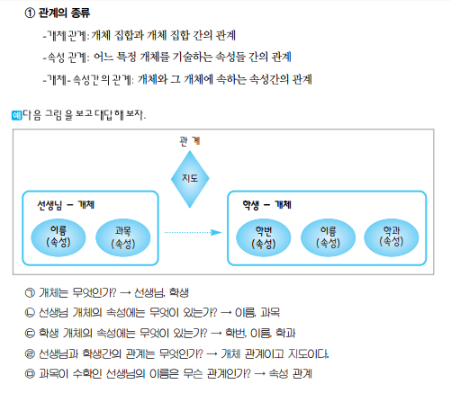
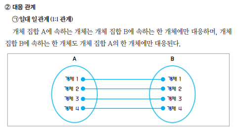
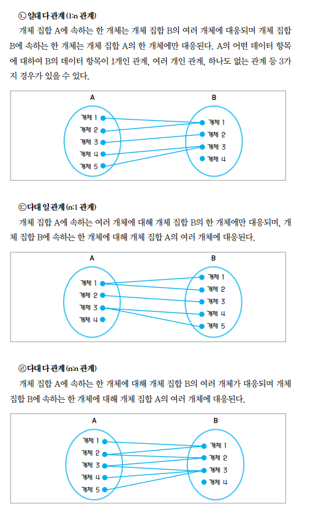


## 1부 1장 학습정리
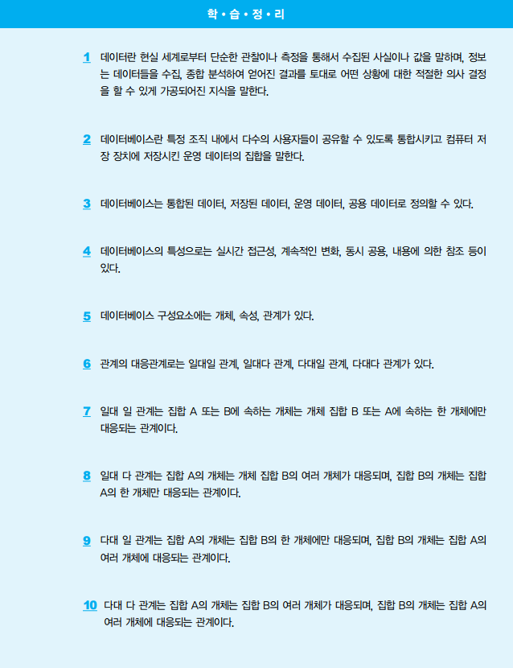
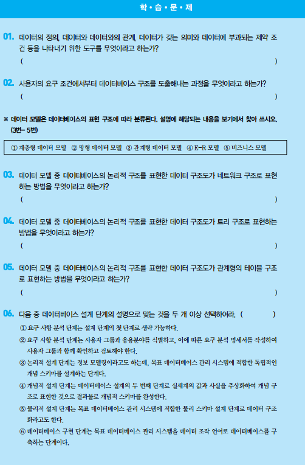
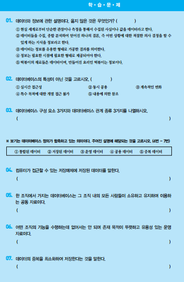

---

## 파일 시스템 단점, 특징
##### 파일 관리 시스템 단점
1. 데이터 파일의 공유가 불가능
2. 데이터의 중복
3. 데이터의 일관성이 없음
4. 데이터 파일의 관리가 어려움
5. 파일의 호환성의 어려움
6. 데이터 형식에 응용 프로그램의 종속

## 데이터베이스 관리 시스템 ( DBMS ) 의 특징
 데이터베이스 관리자라고도 불리며,

 다수의 컴퓨터 사용자들이 데이터베이스 안에 데이터를 기록하거나 접근할 수 있게 해 주는 프로그램이다.

 - DBMS 의 목적 : 데이터베이스 내의 정보를 검색하거나 데이터베이스에 정보를 저장하기 편리하게 하기 위해 보다 효율적인 환경을 제공하는 데 있다.

##### 1. 데이터베이스 관리 시스템의 장점
1. 데이터 중복을 최소화할 수 있다.
2. 데이터의 불일치를 피할 수 있다.
3. 데이터를 공유할 수 있다.
4. 응용 프로그램과 데이터의 독립성이 유지된다.
5. 표준화를 강화할 수 있다.
6. 데이터 보안의 유지가 용이하다.

##### 2. 데이터베이스 관리 시스템의 단점
1. 과다한 비용의 지출이 발생한다.
2. 데이터 복구가 어렵다.
3. 시스템이 취약하다.
4. 텀퓨터의 부담이 크다.


## 1부 2장 학습정리
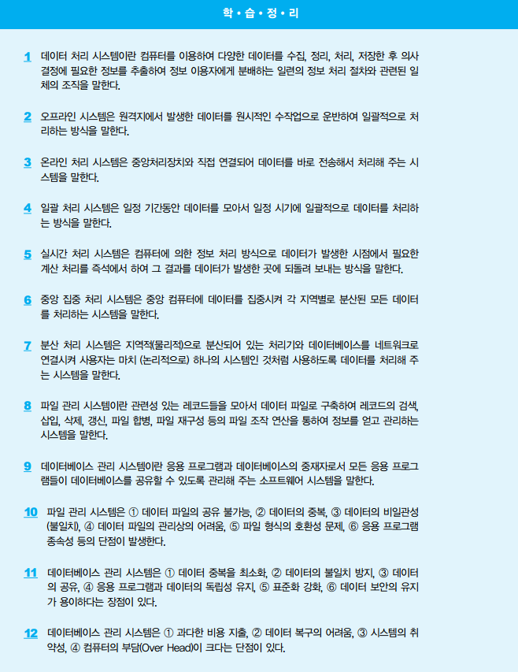
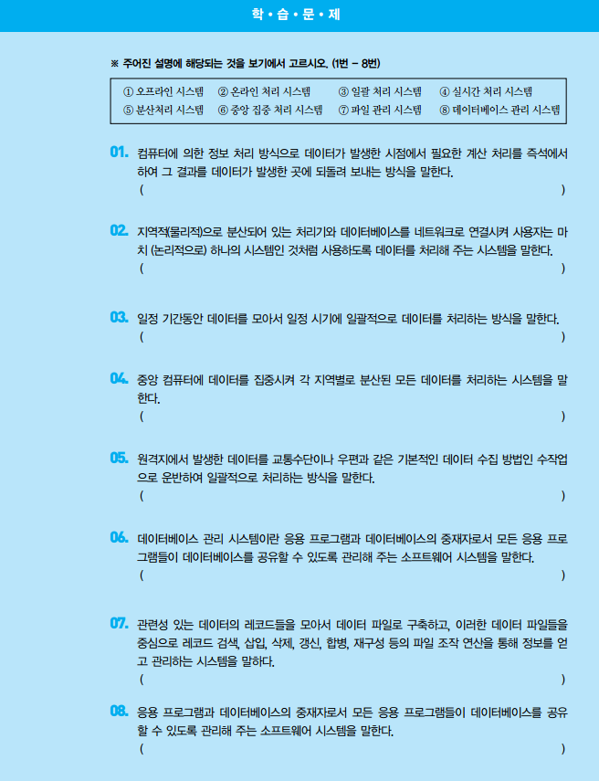
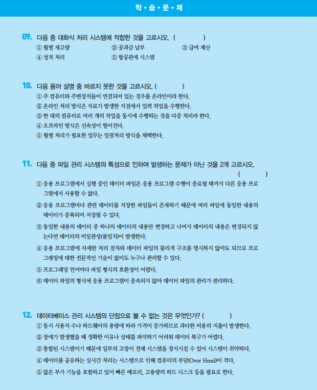

---

## 데이터베이스 스키마
스키마 : 데이터베이스의 구조와 제약 조건에 대한 세부 내용을 기술한 것

데이터의 공용을 전제로 하는 데이터베이스 환경 속에서 데이터베이스를 어떤 입장에서 보느냐에 따라 데이터베이스 스키마는 모두 다르다.

##### 3단계 데이터베이스 스키마
1. 외부 스키마 ( 데이터베이스 사용자 관점 )
 > 3단계 데이터베이스 구조의 최상위 단계로 ```데이터베이스의 개개 사용자나 응용 프로그래머가 접근하는 데이터베이스를 정의```한 것이다.
 >
 > 전체 데이터베이스의 논리적인 한 부분이 되기 때문에 **서브 스키마** 또는 **뷰(View)** 라고 한다.
 >
 > 사용자의 수나 응용 프로그램의 수만큼 많은 외부 스키마가 존재할 수 있다.
 이를 통해 데이터베이스에 접근할 수 있게 되므로 외부 스키마는 ```데이터베이스에 대한 외부로부터의 접근통로의 구실을 하게 된다.```


2. 개념 스키마 ( 총체적인 관점 )
 > 3단계 중간 단계로 데이터베이스 이용 모든 사용자들의 범기관적인 입장에서 정의한 것이다.
 >
 > 즉, ```개체, 관계, 제약 조건, 접근 권한, 보안 정책, 무결성 규칙```에 관한 명세도 포함된다.
 >
 > 그러므로 개념 스키마는 ```응용 시스템들이나 사용자들이 필요로 하는 데이터를 통합한 조직 전체의 데이터베이스```로서 **하나만 존재**한다.
 >
 > **데이터 무결성** : 데이터 및 네트워크 보안에 있어 ```정보가 인가된 사람만 접근 또는 변경 가능```하다는 확실성을 말하는 것으로, ```데이터를 인가되지 않은 방법으로 변경할 수 없도록 보호하는 성질```을 말한다.

3. 내부 스키마 ( 물리적인 저장장치 관점 )
 > 최하위 단계로 ```저장 장치의 입장에서 전체 데이터베이스가 저장되는 방법을 자세히 기록한 것```이다.
 >
 > 개념 스키마에 대한 저장 구조를 정의한 것이다.
 >
 > 여기엔 실제로 저장될 내부 레코드의 형식, 인덱스의 유무, 저장 데이터 항목의 표현 방법에 대한 명세가 포함된다.

참고 : 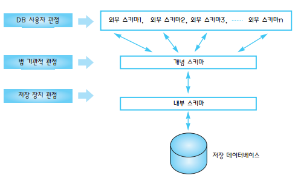

##### 데이터 독립성
1. 물리적 데이터 독립성
 ```내부 단계```의 스키마가 변경되도 ```외부 단계```와 ```개념 단계```의 스키마에는 영향을 미치지 않음

2. 논리적 데이터 독립성
 ```개념 단계```의 스키마가 변경되도 ```외부 단계```의 스키마에는 영향을 미치지 않음

 ##### 데이터 조작 언어 (DML)
 데이터베이스 사용자들이 DB속 실제 데이터에 검색,삽입,삭제,병경등의 조작을 가능하게 해주는 언어적 도구
 > 사용자와 DBMS 사이의 인터페이스 역할

 1. 절차적 데이터 조작 언어 (procedural DML)
  > 사용자가 어떤 데이터를 원하고 어떻게 접근할지 명세해야되는 **초급 데이터 언어**
  >
  > ```한번에 하나의 레코드를 검색```해 호스트 언어와 함께 처리
  >
  > 독자적으로 사용되지 못하고 응용 프로그램 속에 삽입되어 사용됨 (비전문가가 사용하기 어려움)

 2. 비절차적 데이터 조작 언어 (non-procefural DML)
  > 사용자가 무슨 데이터를 원하는지 기록하고 어떻게 접근해야 하는가 기록할 필요가 없는 **고급 데이터 언어**
  >
  > ```한번에 여러 개의 레코드```를 검색해서 처리
  >
  > 독자적이고 상호 작용 형태로 가장 많이 사용되는 고급 명령어 형태의 독립된 데이터 조작 언어를 ```질의어```라고 함
  >> 현재 표준 질의어 : SQL (Structured Query Language)

## 데이터베이스 시스템 구성 요소
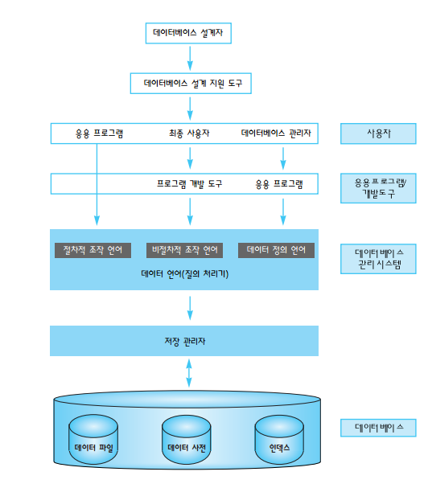
> 데이터베이스 시스템에서 가장 중요한 역할을 수행하는 것은 데이터베이스 관리 시스템이다.

##### 데이터베이스의 구조
1. DB 설계자
2. DB 설계 지원 도구
3. 사용자
4. 응용 프로그램/개발 도구
5. DBMS
6. 데이터베이스

## DBA ( 데이터베이스 관리자 , Database Administrator) 역할
일반 이용자나 응용 프로그래머가 DB를 사용할 때 사용하기 쉽도록 DB의 설계 및 조작과 시스템 분석 및 감독과 같은 ```DB의 시스템 관리 책임, 운영 총괄 책임을 지는 사람```을 일컫는다.
> 역할 : 데이터 표현, 시스템 문서화 표준 결정, 사용자 요구 불평 해결, 장비 성능 감시 등

## 데이터베이스 언어
### 데이터베이스 언어의 이해
- ```데이터베이스를 정의하고 접근하기 위해선 시스템과의 통신 수단이 필요```한데 이를 데이터베이스 언어라고 한다.

- 일반적으로 데이터베이스를 이용하려는 목적에 따라 ```데이터베이스 설계자```, ```데이터베이스 관리자```, ```응용 프로그래머```, ```일반 사용자```로 분리한다.

- 데이터베이스 언어는 기능에 따라 ```데이터 정의 언어 (DDL)```, ```데이터 조작언어 (DML)```, ```데이터 제어 언어 (DCL)```로 분류된다.

##### 데이터 정의 언어 (DDL)
```새로운 데이터베이스를 정의하거나 이미 정의된 데이터베이스의 구조를 변경, 수정하기 위한 언어```이다. 즉, 데이터 정의 언어는 데이터베이스 스키마를 컴퓨터가 알 수 있도록 기술하는데 사용

주로 데이터베이스 설계자나 데이터베이스 관리자가 사용한다.
> 데이터 정의 언어는 외부 스키마와 개념 스키마를 명세하는데 사용

관리자와 설계자가 입력한 데이터 정의 언어의 내용은 DBMS가 번역하여 데이터 사전에 저장됨 ( Meta Data 라 부름 )


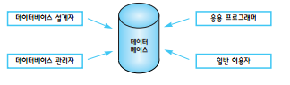

## 2부 1장 학습정리
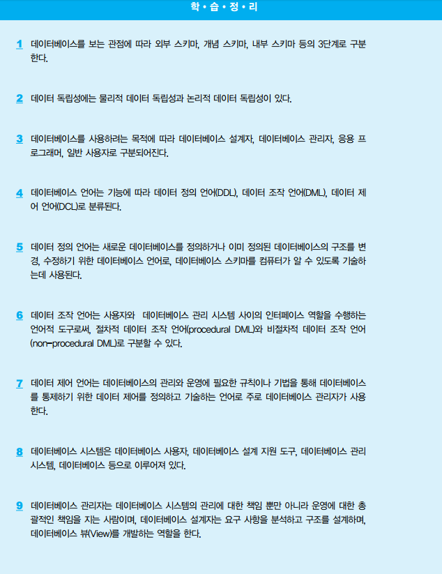
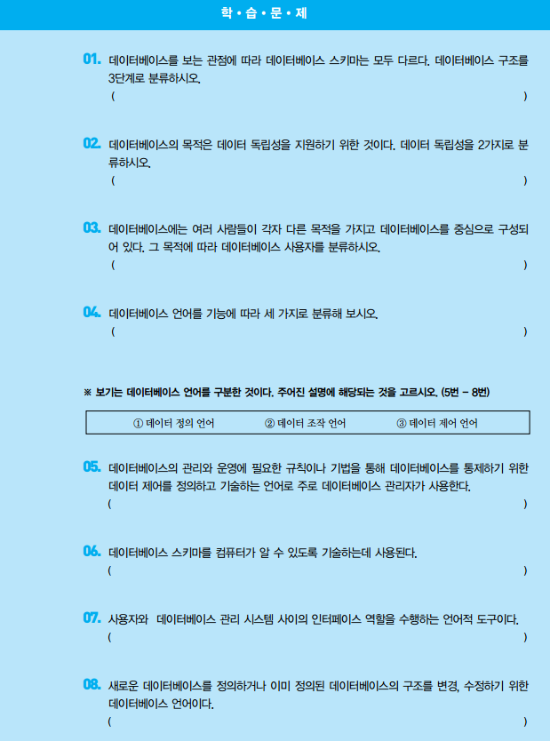

---


## 데이터 모델링의 이해
현실의 불확실한 데이터를 정보 모델링을 통해 사용자의 정보 요구사항을 조사하고, 최대한 DB에 반영하기 위해 가시화 하는 작업

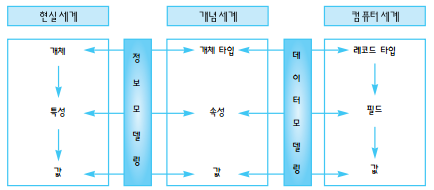
> 데이터 모델링은 현실 세계를 컴퓨터 세계로 표현하기 위한 중간 과정


## 데이터 모델링 표현 구조 분류
1. 계층형 데이터 모델
   > 데이터베이스의 논리적 구조를 표현한 데이터 구조도가 **트리 구조**로 표현된 방법
   > 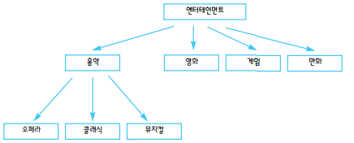

2. 망형 데이터 모델 (=네트워크 데이터 모델)
   > 데이터 구조도가 **네트워크 구조**로 표현된 방법
   > 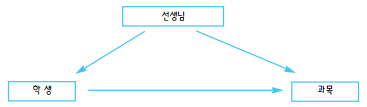

3. 관계형 데이터 모델
  > 데이터 구조도가 **관계형의 테이블 구조**로 표현된 방법
  > 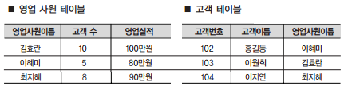


## 데이터베이스 설계
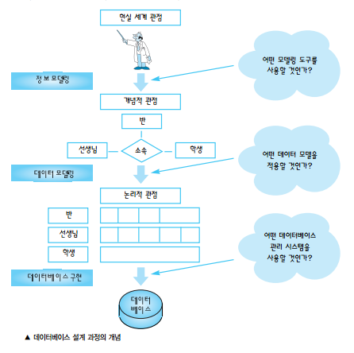
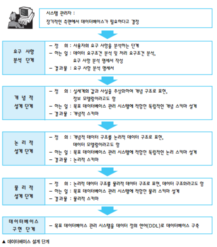


## 2부 2장 학습정리
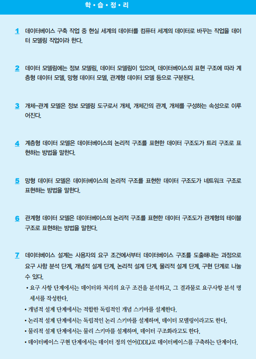

